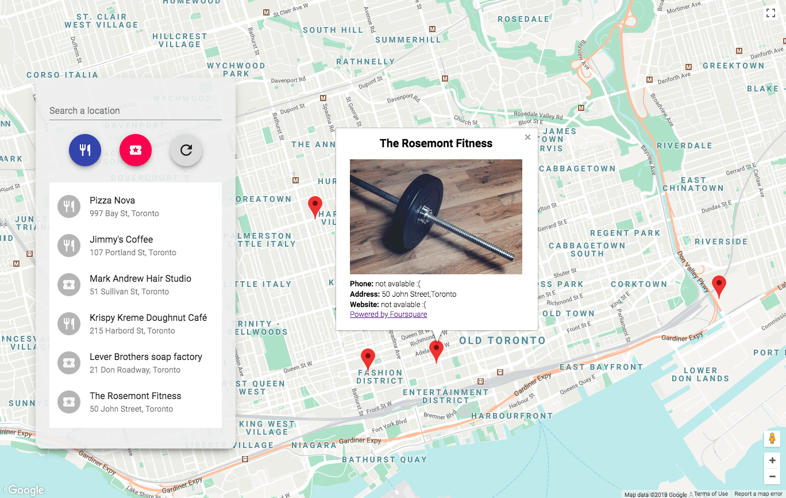

# Neighborhood Map

- [About this project](#about)
- [Features](#features)
- [Requirements](#requirements)
- [Usage](#usage)
- [Third-party libraries](#Third-party-libraries)

<a name="about"></a>

## About
This is the final project for the Udacity Front End Nanodegree Program. This app shows a map of Toronto neighborhood as well as a default list of local places to help users to get basic info of the place. This app is using Foursquare and Google Map API to gain the data access, so please don't abuse the API :)

<a name="features"></a>
## Features
- [x] Google Maps API
- [x] Foursquare API
- [x] React
- [x] Material-UI

<a name="requirements"></a>
## Requirements
- [NPM/nodejs](https://nodejs.org/en/)

<a name="usage"></a>
## how to get started
1. download the .zip file or clone the reposotory
2. use terminal and -cd into the folder
3. run the following code and you are good to go!
```bash
npm install
```
Once installed run:
```bash
-npm start
```
- navigate to [http://localhost:3000](http://localhost:3000) if your broser did not show the magic.

<a name="Third-party-libraries"></a>
## Third-party libraries
[react-async-script-loader](https://www.npmjs.com/package/react-async-script-loader)
[@material-ui/core](https://www.npmjs.com/package/@material-ui/core)